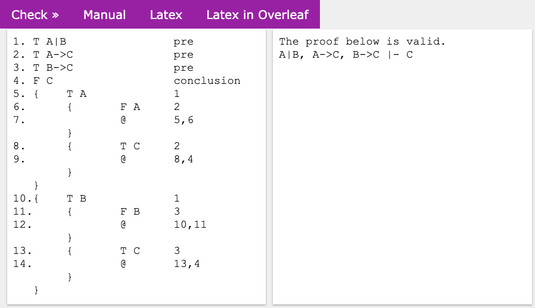

# Analytic Tableau Proof Assistant (ANITA)

The ANITA is a tool written in Python that can be used in *desktop*, or in a [web platform](https://sistemas.quixada.ufc.br/anita/en/). The main idea is that the students can write their proofs as similar as possible to what is available in the textbooks and to what the students would usually write on paper. ANITA allows the students to automatically check whether a proof in the analytic tableaux is valid. If the proof is not correct, ANITA will display the errors of the proof. So, the students may make mistakes and learn from the errors. The web interface is very easy-to-use and has: 
- An area for editing the proof in plain text. The students should write a proof in the Fitch-style.
- A message area to display whether the proof is valid, the countermodel, or the errors on the proof.
- And the following links: 
  - Check, to check the correctness of the proof; 
  - Manual, to view a document with the inference rules and examples; 
  - LaTeX, to generate the LaTeX code of the trees from a valid proof. Use the `qtree` package in your LaTeX code; 
  - LaTeX in Overleaf, to open the proof source code directly in [Overleaf](http://overleaf.com/) that is a collaborative platform for editing LaTeX



## License
ANITA is avalible by a [**MIT License**](license.txt).

## Requirements:
- You must install the [rply 0.7.8 package](https://pypi.org/project/rply/)

## ANITA
You can run ANITA with the command line: 
```bash
python anita_en.py [-i input file] [-output file]
```
## ANITA in Voila
You can run ANITA in Jupyter Nootebook or in a [Voilà](https://voila.readthedocs.io/) 
```bash
voila anita_en.ipynb
```

